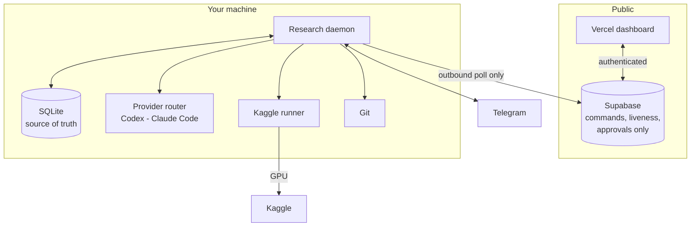

# ResearchOS

A local-first research control plane for long-running machine learning experiments.

## The problem it solves

You submit a training run to Kaggle at midnight and go to sleep. At 03:00 it dies
with a CUDA out-of-memory error during validation. You find out at 09:00. Six GPU
hours and a night are gone, and the fix was one number.

ResearchOS watches the run, recognises the failure, decides whether the fix is safe
to apply on its own, and either applies it and resubmits or wakes you on Telegram
with a one-tap approval. Every experiment, failure and decision is recorded with the
commit that produced it.

It is not a chatbot. It is a control plane for research you are already doing.

## What makes it trustworthy

The design assumption is that an autonomous agent left alone with a thesis will,
sooner or later, do something scientifically damaging unless prevented structurally.

- **Two independent gates.** A change runs unattended only if the failure classifier
  *and* the policy engine both allow it. Either objecting sends it to a human.
- **The held-out test set is inviolable.** It cannot be optimised on, in any mode,
  even if a policy file says otherwise. So is data leakage.
- **Locked evaluation mode** permits only infrastructure recovery that cannot change
  scientific meaning, and even that needs approval.
- **Failures are kept.** Rejected and failed experiments are never deleted, which
  makes selective reporting harder rather than easier.
- **Nothing is fabricated.** A metric the run did not emit stays absent instead of
  becoming a zero. Provider quota is not displayed because no CLI reports it
  reliably.
- **Budgets survive restarts.** Retry and failure limits are read from SQLite, so
  killing the daemon does not grant a fresh allowance.
- **No silent spending.** Subscription auth only. The system refuses to start if an
  API key is present without explicit opt-in.

## Architecture



Two rules follow from this shape. The daemon **polls outbound**, so your laptop never
opens an inbound port. And Supabase carries **only coordination metadata** — liveness,
commands, approvals, short event lines. Experiments, metrics, logs, code and
checkpoints never leave your machine.

SQLite is authoritative. If local and remote ever disagree, local wins.

## Quick start

```bash
researchos init --project my-thesis
researchos doctor
researchos start
```

`doctor` checks every integration with the same code paths the daemon uses, so a
broken credential shows up before an overnight run rather than after it.

Full setup: [docs/SETUP.md](docs/SETUP.md) · Windows notes:
[docs/WINDOWS_SETUP.md](docs/WINDOWS_SETUP.md)

## Commands

| Command | What it does |
|---|---|
| `researchos doctor` | Check providers, Kaggle, Telegram, state, safety flags |
| `researchos start` | Run the daemon and the local API |
| `researchos stop` | Ask a running daemon to exit |
| `researchos status` | Daemon and experiment status |
| `researchos events` | Recent structured event stream |
| `researchos token` | Print the local API token for the dashboard |
| `researchos bundle EXP-0038 --code nb.ipynb` | Package an experiment for external execution |
| `researchos import returned.zip --experiment EXP-0038` | Import external results |
| `researchos export` | Dump experiments as JSON |
| `researchos providers test` | Live provider check |
| `researchos telegram test` | Send a test message |
| `researchos kaggle test` | Verify Kaggle auth |

## Operating modes

| Mode | The agent may |
|---|---|
| `manual` | Analyse and propose. Every change waits for you. |
| `auto_exploration` | Change editable fields alone. Approval-gated and locked fields still stop it. |
| `locked_evaluation` | Only recover infrastructure failures, and only with approval. |

Modes can only ever tighten what the policy file permits, never loosen it.

## Documentation

| Document | Contents |
|---|---|
| [ARCHITECTURE.md](docs/ARCHITECTURE.md) | Components and why the boundaries sit where they do |
| [SETUP.md](docs/SETUP.md) | First-time setup |
| [WINDOWS_SETUP.md](docs/WINDOWS_SETUP.md) | Windows specifics and autostart |
| [SCIENTIFIC_GUARDRAILS.md](docs/SCIENTIFIC_GUARDRAILS.md) | The policy engine and research integrity |
| [EXPERIMENT_LIFECYCLE.md](docs/EXPERIMENT_LIFECYCLE.md) | States, transitions, provenance |
| [PROVIDERS.md](docs/PROVIDERS.md) | Claude Code and Codex routing |
| [KAGGLE.md](docs/KAGGLE.md) | GPU execution backend |
| [EXTERNAL_RUN_FALLBACK.md](docs/EXTERNAL_RUN_FALLBACK.md) | What to do when quota runs out |
| [TELEGRAM.md](docs/TELEGRAM.md) | Remote control and approvals |
| [DEPLOYMENT.md](docs/DEPLOYMENT.md) | Supabase and Vercel |
| [SECURITY.md](docs/SECURITY.md) | Secret handling |
| [THREAT_MODEL.md](docs/THREAT_MODEL.md) | What this defends against, and what it does not |
| [TROUBLESHOOTING.md](docs/TROUBLESHOOTING.md) | Common failures |
| [TOOLS.md](docs/TOOLS.md) | Every external tool and why it is installed |
| [HERMES.md](docs/HERMES.md) | Why Hermes is installed but unused |
| [AUTORESEARCH.md](docs/AUTORESEARCH.md) | Relationship to Karpathy's autoresearch |
| [STATUS.md](docs/STATUS.md) | **What is verified, what is not, what is unfinished** |
| [ROADMAP.md](docs/ROADMAP.md) | What comes next |

Read [STATUS.md](docs/STATUS.md) before trusting any part of this with real work. It
states plainly which integrations have been exercised against live services and which
have only been tested against seams.

## Development

```bash
pip install -e ".[dev]"
pytest -q
ruff check src tests
```

The suite runs without credentials, without network, and without spending GPU quota:
Kaggle, the providers, Telegram and Supabase are all reached through seams that tests
replace. That is deliberate — CI must never consume the researcher's compute budget.

## Licence

Private project. Third-party attributions in
[THIRD_PARTY_NOTICES.md](THIRD_PARTY_NOTICES.md).
