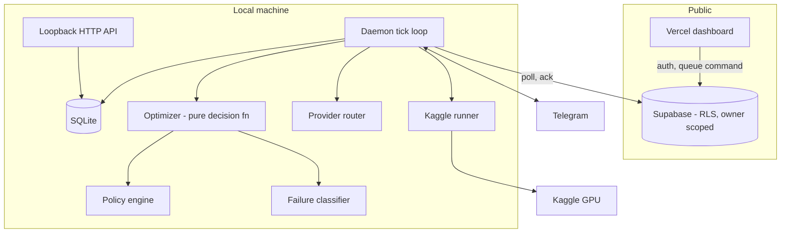

# Architecture

## Why the boundaries sit where they do

Three constraints shaped every structural decision.

**Research code must stay local.** Claude Code, Codex, the Kaggle CLI, git and your
Python environment all live on your machine and hold your authenticated sessions.
None of that can move to a serverless function, so the engine runs locally and the web
tier is a view onto it.

**The laptop must not accept inbound connections.** Exposing a port from a personal
machine to the internet is the kind of decision that looks fine until it isn't. The
daemon therefore polls the coordination layer outbound. Commands travel by being
written to a table the daemon reads, never by anyone connecting to you.

**One store must be authoritative.** Distributed state without a clear owner produces
disagreements nobody can adjudicate. SQLite on your machine is the record; everything
else is a cache or a view. If they disagree, local wins.

## Layers

## The tick

One iteration, ordered deliberately: **observe, persist, then notify.** A message
never describes a state change that was not already written, so a crash cannot leave
you told about something the database does not contain.

1. Write heartbeat (liveness only, never status, which would un-pause a paused loop)
2. Poll Telegram
3. Drain remote commands, acking each so it cannot run twice
4. Check budgets; pause if exhausted
5. Poll in-flight Kaggle runs; on completion record metrics, on failure diagnose
6. Push liveness, new events and pending approvals upward

## The decision function

`decide_next_action` is pure: diagnosis, policy, mode, retry count, quota to action.
No I/O. This is what makes 3am behaviour testable, since every branch is exercised
without Kaggle, a provider or a network.

Order matters and is load-bearing:

1. Budget exhausted -> abandon (a runaway loop cannot argue past a limit)
2. Quota gone -> external bundle (retrying without GPU cannot succeed)
3. Unrecognised failure -> escalate to a provider
4. Policy denies -> abandon
5. Policy or classifier wants approval -> ask
6. Otherwise -> retry automatically

## Crash recovery

Runs left in `submitted` or `running` when the process died are found on restart. They
are **not** marked failed: the Kaggle kernel kept executing server-side, so only a real
status poll may decide the outcome. Assuming failure would corrupt the record.
