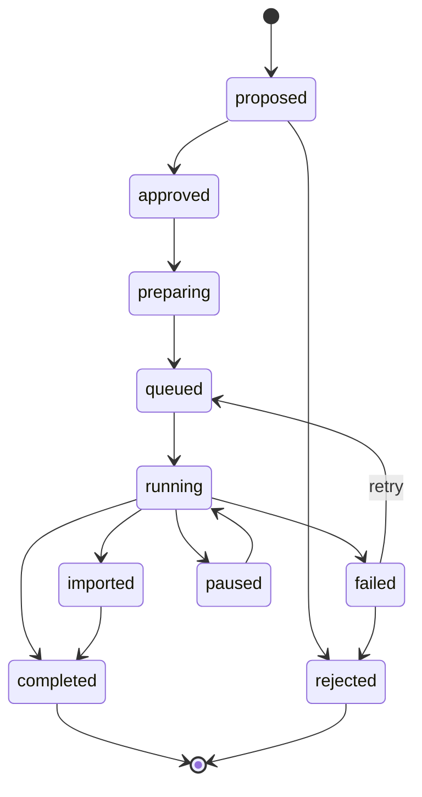

# Experiment lifecycle

## States

Transitions are enforced by a table, so an illegal move raises rather than silently
corrupting lineage. Terminal states cannot be left.

`failed -> queued` is what a retry is: the experiment returns to the queue with an
incremented retry count, and the budget is checked before it may do so again.

## Run states

`pending -> submitted -> running -> complete | error | timeout | cancelled`

A run is one execution attempt. Retries create new runs against the same experiment,
numbered by `attempt`.

## Provenance

Every experiment records the parent it descends from, the git commit, methodology
version, config and notebook hashes, dataset and version, seeds, the provider used,
the mode it ran under, and its failure class if any.

That is what makes the record auditable: for any result you can say what ran, why it
ran, what changed, which agent changed it, which commit produced it, and which Kaggle
run generated the number.

## Preservation

Failed and rejected experiments are never deleted. A run reporting no metric never
becomes the new best. Both properties make selective reporting harder rather than
easier.
